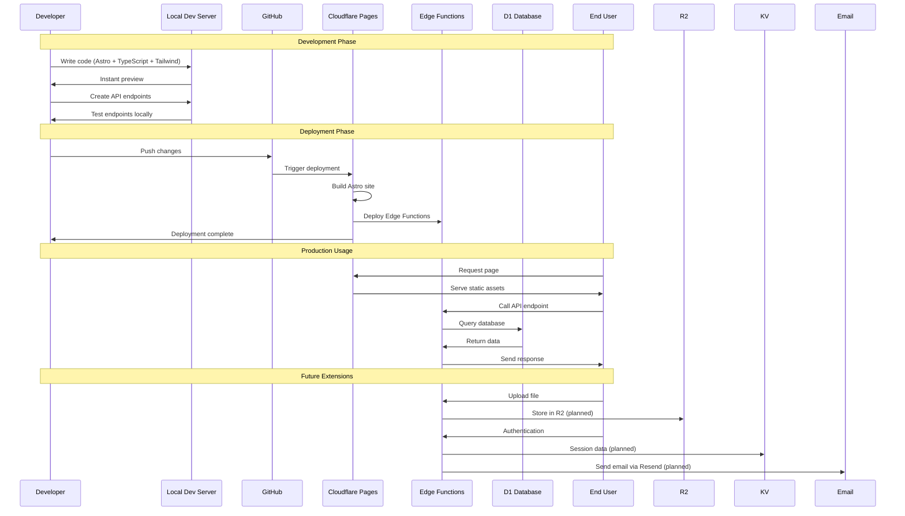

After spending years working with Rails applications deployed on traditional servers and containers, I've been exploring more efficient ways to build and maintain web applications. Today, I'm excited to share **Astroflare** - my opinionated starter template that combines the speed of [Astro](https://astro.build) with the power of [Cloudflare's edge platform](https://developers.cloudflare.com/).

## Why Astroflare?

Modern web development involves too much maintenance overhead. We spend countless hours upgrading dependencies, patching security vulnerabilities, and managing server infrastructure - time that could be better spent building actual features and solving real problems.

Astroflare addresses this by leveraging two powerful technologies:

1. **Astro 5** - A modern web framework that delivers lightning-fast performance by shipping minimal JavaScript and leveraging the power of server-side rendering.

2. **Cloudflare's Edge Platform** - A globally distributed network that brings your application closer to users while eliminating traditional server management.

## Core Features

The current release of Astroflare includes:

### 1. Cloudflare D1 Integration
Built-in database support through Cloudflare D1 (SQLite at the edge), with a complete CRUD example implementation for an "items" collection. This demonstrates proper edge database patterns without the complexity of traditional database setups.

### 2. Edge Functions via Cloudflare Workers
API endpoints built directly into the application with proper TypeScript typing and error handling. This eliminates the traditional API/frontend separation, allowing for a more cohesive development experience.

### 3. TailwindCSS 4 Integration
The latest version of TailwindCSS for rapid UI development without the bloat of large CSS frameworks or component libraries. This ensures your applications remain lightweight while still looking great.

### 4. Simple Authentication System
A basic auth system that can be easily extended for more complex authentication needs, demonstrating key security patterns for edge-deployed applications.

### 5. TypeScript Throughout
Full TypeScript support from frontend to API endpoints, providing type safety and improved developer experience.

### 6. Comprehensive Testing Examples
Built-in API testing capabilities that make it easy to verify your database connections and CRUD operations are working as expected.

## Coming Soon to Astroflare

I'm actively working on enhancing Astroflare with additional features:

### 1. R2 Storage Integration

Cloudflare R2 offers an S3-compatible object storage solution that works seamlessly with the edge. The upcoming Astroflare release will include:

- File upload/download helpers
- Image optimization pipeline
- Public/private file access controls
- Direct-to-R2 upload patterns for larger files

This will replace traditional file storage systems that often become bottlenecks in web applications.

### 2. KV for High-Performance Data

Cloudflare KV (Key-Value) store will be integrated for:

- Session management
- Feature flags and configuration
- Cache storage
- Rate limiting implementation

The integration will include TypeScript helpers and proper abstraction layers to make working with KV intuitive.

### 3. Secrets Management

A robust secrets management system is in development that will:

- Automatically sync environment variables to Cloudflare's secrets
- Validate the presence of required secrets before deployment
- Generate strongly-typed interfaces for your environment variables
- Provide local development configurations that mirror production

This will eliminate the common "it works on my machine" problems when dealing with environment variables.

### 4. Email Integration with Resend

Sending emails shouldn't require standing up an entire email server. The upcoming Resend integration will provide:

- Transactional email templates
- Email verification flows
- Newsletter/notification distribution
- Email analytics and tracking

All while maintaining the simplicity that makes Astroflare special.

## Database Design for Multi-Tenancy

One of the interesting architectural decisions I'm making with Astroflare is adopting a **table-per-user** design pattern for multi-tenant applications. Each user gets their own dedicated table in D1, which offers several benefits:

1. **Complete Data Isolation** - No risk of data leakage between users
2. **Simplified GDPR/Privacy Compliance** - Need to delete a user's data? Drop their table.
3. **Flexible Schema Evolution** - Users can be on different versions of your schema
4. **Performance Benefits** - Smaller tables are faster to query
5. **Easier Backups and Restores** - Export/import individual user data without affecting others

This approach works particularly well for low to medium-scale SaaS applications where data volume per user is manageable, perfectly aligning with D1's performance characteristics.

## Authentication and Payment Plans

While current authentication is basic, I'm designing a comprehensive authentication system that will include:

- OAuth provider integration (Google, GitHub, etc.)
- Magic link authentication
- Two-factor authentication
- Session management
- Role-based access control

For monetization, I'm planning a straightforward payment integration with:

- Subscription management via Stripe
- Usage-based billing options
- Free/paid tier management
- Trial functionality
- Payment reminder emails

Both systems will be modular, allowing you to use what you need for your specific project.

## Astroflare Workflow

The following sequence diagram shows the typical workflow when building and deploying an application with Astroflare:



This diagram illustrates the three main phases of working with Astroflare:

1. **Development Phase**: Building your application locally with immediate feedback
2. **Deployment Phase**: Pushing to GitHub and automatic deployment to Cloudflare
3. **Production Usage**: How user requests flow through the system

The bottom section shows the planned extensions for file storage (R2), authentication (with KV), and email (via Resend).

## How Astroflare Works

Let me walk through a typical user journey in an Astroflare application:

1. **Development**: You build your application using Astro, TypeScript and TailwindCSS, creating both UI components and edge function API endpoints in the same codebase.

2. **Deployment**: With a simple `git push` or through CI/CD, your application is deployed to Cloudflare Pages, which distributes it globally across Cloudflare's edge network.

3. **User Interaction**: When a user visits your application:
   - Static content is served instantly from the nearest edge location
   - Dynamic content is rendered through Astro's server-side rendering
   - API requests are handled by edge functions running close to the user
   - Data is stored/retrieved from D1 databases, also running at the edge
   - Files are stored in R2, authentication state in KV, all without dedicated servers

4. **Business Operations**: In the background, the platform handles:
   - User authentication and session management
   - Subscription and payment processing
   - Email communication for notifications and marketing
   - Data isolation through the per-user table design

All of this happens without you having to manage servers, worry about scaling, or deal with traditional infrastructure concerns. The architecture is designed to be:

- **Resilient**: Distributed across Cloudflare's global network
- **Performant**: Running close to users with minimal latency
- **Secure**: Protected by Cloudflare's security features
- **Cost-effective**: Pay only for what you use, with no idle servers
- **Maintainable**: Simple codebase with minimal dependencies

## Why I Built This

After my experience migrating Linkarooie from Rails to Astro, I realized how much simpler the development and maintenance cycle became. No more worrying about server updates, dependency conflicts, or complex deployment procedures.

Astroflare represents this philosophy - focusing on building features rather than maintaining infrastructure. It's designed for developers who want to move fast, stay secure, and deliver exceptional performance without the traditional overhead.

## Get Started with Astroflare

Ready to try it out? Astroflare is [available on GitHub](https://github.com/loftwah/astroflare).

To get started:

```bash
# Clone the repository
git clone https://github.com/loftwah/astroflare.git my-project

# Install dependencies
cd my-project
npm install

# Start the development server
npm run dev
```

I'd love to hear your feedback and see what you build with it. Feel free to open issues, submit pull requests, or reach out to me directly.

Here's to building simpler, faster, and more maintainable web applications!

---

**Dean "Loftwah" Lofts**  
[GitHub](https://github.com/loftwah) | [Twitter](https://twitter.com/loftwah) | [Blog](https://blog.deanlofts.xyz)
